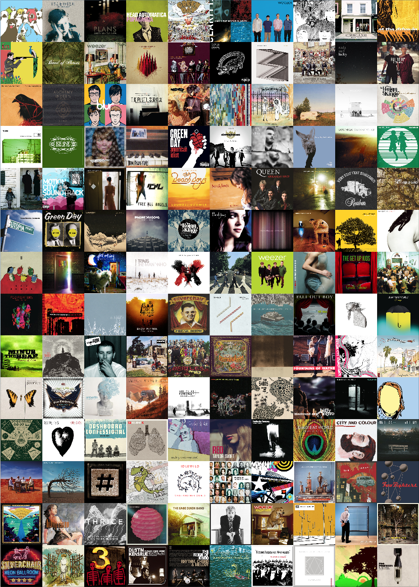

# lastfm-collage
Download covers for your top albums in Last.fm

Covers downloaded from [iTunes](https://www.apple.com/itunes).

## Requirements
  * Python 3.5
  * [ImageMagick's](http://www.imagemagick.org/) montage

## Usage

```
$ ./top-albums.py -n 140 -a <lastfm_user1> <lastfm_user2> > topalbums.txt

$ ./download-covers.py topalbums.txt -o covers

$ montage covers/* -geometry 640x640 -tile 10x14 poster.png
```

## Sample


